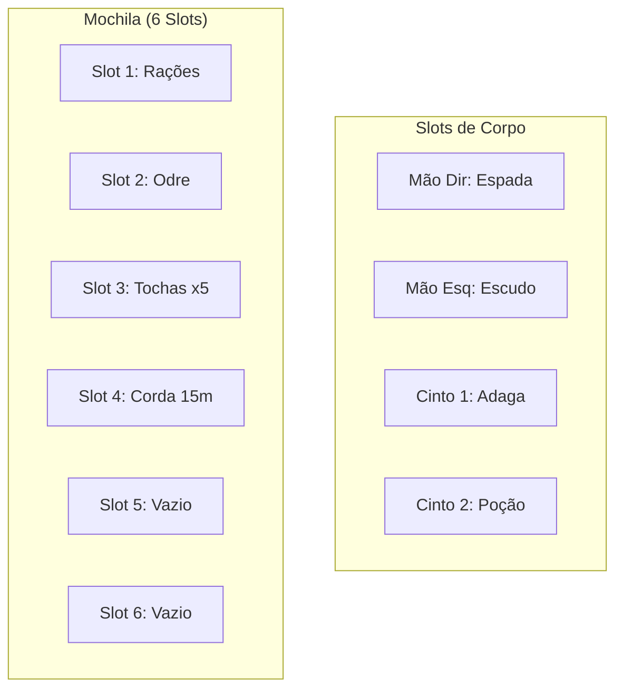

# Sistema de Inventário — Arkadice

O sistema de inventário de Arkadice foca na **gestão de recursos e decisões espaciais**. Em vez de contar quilos ou gramas, o sistema utiliza **Slots de Inventário**, tornando a logística simples, visual e impactante na jogabilidade.

> *Um aventureiro é tão bom quanto o que ele consegue carregar até a saída.*

---

## Estrutura de Slots

Cada personagem começa com uma capacidade base definida pelo seu corpo e equipamento inicial.

| Localização | Slots Disponíveis | Notas |
| ------------- | ------------------- | ------- |
| **Mão Principal** | 1 Slot | Normalmente ocupado por uma arma |
| **Mão Secundária** | 1 Slot | Ocupado por escudo, tocha ou arma leve |
| **Cinto** | 2 Slots | Requer um cinto ou bandoleira (itens de acesso rápido) |
| **Mochila Base** | 6 Slots | Onde a maioria dos suprimentos é guardada |

!!! tip "Dica de Exploração"
    Personagens podem aumentar sua capacidade adquirindo mochilas maiores, alforjes ou equipamentos de expedição especializados.

---

## Tamanho dos Itens

A quantidade de slots que um item consome depende do seu volume e praticidade.

### Itens Volumosos (2 Slots)

Itens que exigem as duas mãos para serem operados ou que são desajeitados para carregar.

- *Exemplos:* Armas pesadas (montantes, arcos longos), armaduras pesadas (quando não vestidas), sacos de dormir, escada de corda.

### Itens Normais (1 Slot)

A maioria das ferramentas e equipamentos de aventura.

- *Exemplos:* Espadas, escudos médios, rações para 1 dia, tochas (unidade), odre de água.

### Itens Pequenos (Agrupáveis)

Itens muito pequenos podem ser agrupados em um único slot.

- **Até 5 itens** do mesmo tipo ocupam **1 slot**.
- *Exemplos:* Moedas (até 100), gazuas, ervas medicinais, flechas/virotes (até 20 por slot), poções pequenas.

---

## Sobrecarga e Debuffs (Lotado!)

Quando um personagem preenche todos os seus slots disponíveis, ele atinge seu limite físico. No entanto, é possível carregar itens "além da conta", mas a um custo alto.

### Limite de Capacidade

- **Capacidade Máxima:** A soma de todos os slots de mãos, cinto e mochila.
- **Inventário Lotado:** Se o personagem utilizar qualquer slot além do limite base (ex: carregando algo extra nos braços ou pendurado precariamente), ele recebe o estado **Sobrecarregado**.

### Efeitos de Sobrecarregado

Enquanto estiver sobrecarregado, o personagem sofre as seguintes penalidades:

- **Movimento:** Reduzido em 50%.
- **Vantagem/Desvantagem:** Recebe **Desvantagem** em todos os testes de Atletismo, Acrobacia e Furtividade.
- **Exaustão:** Se viajar por um longo período sobrecarregado, deve realizar testes de Tenacidade para não receber níveis de Fadiga.

---

## Exemplo Visual

---

## Dicas para o Mestre

- Itens vestindo (como a armadura atual) **não ocupam slots na mochila**, mas podem dar penalidades base de esquiva (veja [Equipamentos](../02_Compendio/01_Equipamentos_e_Forja.md)).
- Peça testes de sorte quando um personagem sobrecarregado cair ou sofrer um impacto; itens podem quebrar ou se perder.
