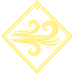

# 🪨 Anão

*"Nossa honra é tão profunda quanto as raízes da montanha, e nossa vontade é tão dura quanto o aço que forjamos."*

*Mestres do aço e guardiões das montanhas, os Anões são a personificação da resiliência e da tradição em Arkadice.*

***

## 📊 Ficha Técnica (Anão)

| ATRIBUTO | VALOR | AFINIDADE | CHANCE |
| :--- | :---: | :---: | :---: |
| **PV Base** | 12 | { width="20" .element-icon } Terra | 45% |
| **Velocidade** | 6m | { width="20" .element-icon } Ignis | 35% |
| **Sekhem Base** | 8 - 13 | { width="20" .element-icon } Aqua | 15% |
| **Dado Sekhem** | 1d6+7 | { width="20" .element-icon } Aer | 5% |
| **Absorção de Base** | 2 | - | - |

***

## 📜 Tradição e Fisiologia

### 👤 Aparência

Baixos e robustos (1.20m-1.50m), com corpos largos e densamente musculosos. Suas peles ostentam tons terrosos e seus olhos brilham como âmbar ou pedras preciosas. As barbas são símbolos de status e idade, frequentemente adornadas com anéis de clã.

### 🏛️ Sociedade

Vivem em imponentes fortalezas subterrâneas esculpidas no coração das montanhas. Sua sociedade é um relógio de precisão baseado em clãs e ofícios. Cada anão carrega o nome do seu clã como uma promessa — para eles, a desonra é uma ferida que nem o tempo cura.

### ⚒️ Cultura

Ferreiros, mineradores e engenheiros natos. Os anões acreditam que a perfeição é alcançada através do martelo e da bigorna, não de fórmulas mágicas. São céticos em relação ao arcano e devotos de uma boa cerveja artesanal após um longo dia de forja.

***

## 🔨 Laço do Clã (Mecânica Exclusiva)

A maestria artesanal dos anões transcende a técnica — é um ritual sagrado. Uma vez por **descanso longo**, ao forjar ou reparar um equipamento, o item recebe **+1 temporário na qualidade** até o próximo descanso longo. Este bônus se aplica a Resistência%, Absorção, ou Dano da arma (escolha do jogador).

> *"Cada martelada carrega o nome do clã. Um anão não conserta um escudo — ele o reforja com honra."*

***

!!! success "Dádivas Raciais (Bônus)"
    **Escolha uma das opções abaixo durante a criação do personagem:**

    *   **💪 Vigor da Forja**: Resistência brutal a toxinas. Vantagem dupla em testes contra Venenos e asfixia. Durante um descanso curto, você pode aplicar unguentos e consumir cervejas purificadoras para ganhar **1d6 PV Temporários** para a próxima cena de combate.
    *   **🔥 Sangue de Forja**: Proficiência **Praticante** com Martelos ou Machados. Avalia qualidade de metal/armadura com um toque.

!!! failure "Limitações (Debuffs)"
    **Escolha uma das opções abaixo para equilibrar sua linhagem:**

    *   **⚖️ Pernas Curtas**: Velocidade limitada a 5m. Limite máximo de **Esquiva** reduzido em 10% (cap 40%).
    *   **⚠️ Aversão Arcana**: Feitiços custam **+1 Sekhem** adicional.
