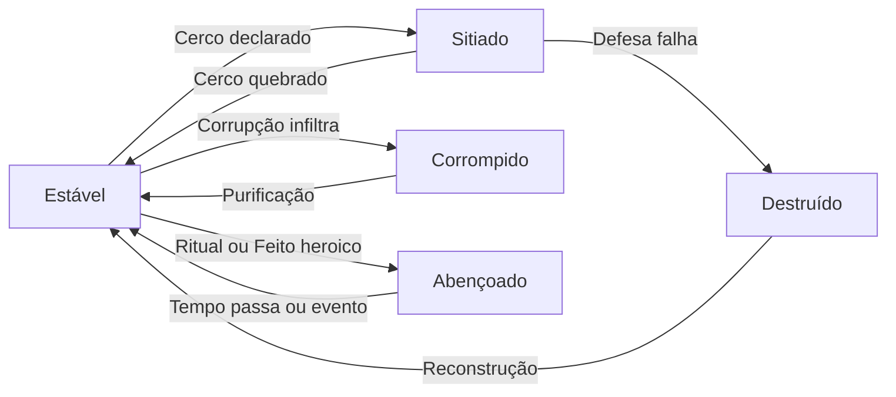

# Sistema de Santuário

Um Santuário não é um menu de melhorias — é um lugar no mapa que respira. Quando o grupo encontra uma torre abandonada nas montanhas, um farol esquecido na costa ou as ruínas de um templo engolido pela floresta, ele pode reivindicá-lo como seu. A partir desse momento, o lugar se torna parte da história tanto quanto qualquer personagem.

O Santuário cresce com o grupo. Cada cicatriz na muralha, cada biblioteca construída, cada ritual gravado nas pedras conta a história de quem mora ali. Se outro grupo de aventureiros encontrar esse Santuário abandonado daqui a trinta anos, eles saberão — pelas armas penduradas nas paredes, pelos círculos de Sekhem gravados no chão, pelos nomes entalhados na entrada — quem foram as pessoas que viveram nesse lugar.

Mas o Santuário também sangra. Ele pode ser cercado por exércitos, corrompido por magia negra, abençoado por entidades antigas ou reduzido a cinzas. Protegê-lo é uma escolha; abandoná-lo, outra. Ambas têm consequências.

---

## 1. Estados do Santuário

O Santuário possui **um estado ativo** por vez. O estado muda conforme os eventos da campanha e tem efeitos mecânicos imediatos sobre o grupo.

| Estado | Gatilho | Efeito Mecânico |
|--------|---------|-----------------|
| **Estável** | Sem ameaças ativas | Bônus padrão do estágio. Downtime funciona normalmente. |
| **Sitiado** | Facção inimiga declara cerco ou invasão | **Custo de Vida ×2**. Sem acesso a comércio externo. Cada semana: teste de Defesa ou o Santuário sofre dano. |
| **Corrompido** | Magia de Perditio, traição interna, artefato maldito | **-2 em todas as recuperações de Sekhem** no local. Rituais falham em 1-3 no d6. Exige **Purificação** para reverter. |
| **Abençoado** | Ritual sagrado bem-sucedido, feito heroico, Patrono divino | **+2 Sekhem** em todo descanso no local. Descanso longo remove **1 condição adicional**. Dura até o fim do arco ou 4 semanas. |
| **Destruído** | Cerco vencido pelo inimigo, catástrofe | **Sem base**. Grupo torna-se nômade. Pode reconstruir (50% do custo original) ou encontrar novo local. |

### Transições de Estado

!!! warning "Estados Não Acumulam"
    O Santuário só pode estar em **um** estado por vez. Se estiver Sitiado E corrupção se manifesta, o Mestre escolhe qual estado predomina com base na ameaça mais urgente.

---

## 2. Estágios de Evolução

O Santuário evolui em **4 estágios**. Cada estágio exige um **evento narrativo real** como pré-condição — dinheiro sozinho não evolui nada.

### Resistência e Defesa do Santuário

Cada Santuário é único. Os valores abaixo são **referências** — o Mestre ajusta conforme a localização, materiais usados e contexto narrativo. Uma torre de pedra nas montanhas resiste mais que uma casa de madeira no pântano.

| Estágio | Resiliência (referência) | Guarda (referência) | Bônus de Downtime |
|---------|:---:|:---:|:---:|
| Refúgio | 8 a 12 | CD 8 a 10 | +0 |
| Bastião | 16 a 24 | CD 9 a 11 | +1 |
| Fortaleza | 24 a 36 | CD 10 a 13 | +2 |
| Cidadela | 32 a 48 | CD 11 a 14 | +3 |

> **Resiliência** é quanto dano o Santuário aguenta antes de cair. **Guarda** é a dificuldade para forças inimigas danificarem a estrutura. O Mestre define os valores exatos na criação com base na ficção: uma caverna natural tem Resiliência alta mas Guarda baixa (difícil de destruir, fácil de invadir). Uma paliçada de madeira tem Guarda razoável mas Resiliência baixa (fácil de queimar).

---

### Estágio 1 — Refúgio

*Um teto seguro e pouco mais. Mas é seu.*

| Requisito | Custo |
|-----------|-------|
| Encontrar e limpar um local abandonado ou selvagem | 50 ΔP + 1 semana de trabalho |

**Desbloqueia:**

- Descanso Longo seguro (sem risco de emboscada noturna)
- Armazenamento básico (até 20 itens comunitários)
- **Semente da Vocação** — o grupo começa a marcar o espaço (ver Seção 3)

---

### Estágio 2 — Bastião

*Paredes reforçadas, uma forja acesa, um nome na região.*

| Requisito | Custo |
|-----------|-------|
| **Defender com sucesso** o Refúgio de pelo menos 1 ameaça real (bandidos, criatura, facção menor) | 200 ΔP + materiais de construção (madeira reforçada, pedra, ferro) |

**Desbloqueia:**

- **Oficina** (escolha 1): Forja de Armas, Laboratório Alquímico ou Biblioteca
- **1 Aposento Especial** (ver tabela abaixo)
- **Vocação Nascente** — bônus parcial da vocação escolhida (ver Seção 3)

---

### Estágio 3 — Fortaleza

*Uma presença no mapa. Caravanas sabem seu nome. Inimigos também.*

| Requisito | Custo |
|-----------|-------|
| Completar **1 arco narrativo inteiro** baseado na defesa, expansão ou reputação do Santuário | 500 ΔP + 1 Recurso Épico (material raro obtido em aventura) |

**Desbloqueia:**

- **Sala de Conselho**: +2 em testes de Pesquisa e Tática feitos no Santuário
- **Vocação Plena** — bônus completo da vocação (ver Seção 3)
- **2 Aposentos Especiais** adicionais

---

### Estágio 4 — Cidadela

*Uma fortaleza de lenda. NPCs pedem refúgio. Reis enviam emissários.*

| Requisito | Custo |
|-----------|-------|
| Pelo menos 1 membro do grupo em **Tier 3+** lidera as melhorias + evento político ou militar resolvido (aliança, tratado, vitória decisiva) | 1000 ΔP + aliança formal com facção do mundo |

**Desbloqueia:**

- **NPCs Residentes** (até 3): ferreiro, curandeiro, bibliotecário, espião — cada um oferece serviço permanente
- **Renda Administrada** (ver mecânica abaixo)
- **Sala de Rituais**: permite conjuração de feitiços de longa duração com Sekhem armazenado
- **3 Aposentos Especiais** adicionais

---

### Renda Administrada (Estágio 4)

A Cidadela pode gerar renda, mas **nunca passivamente**. O grupo designa um responsável (jogador ou NPC residente) que administra as operações — comércio, pedágio, serviços.

- **Cada semana**, o administrador faz um teste: `d20 + Presença + Proficiência relevante vs CD 12`
- **Sucesso:** Ganha **2d6 ΔP** para o cofre do Santuário
- **Falha:** Prejuízo — perde **1d4 ΔP** em manutenção, roubo ou ineficiência
- **Se NPC administra:** Rola com bônus +2, mas o grupo não controla *como* o dinheiro é gasto. O NPC pode desviar recursos, contratar guardas a mais, ou investir mal. Risco narrativo real.

> Um NPC corrupto pode drenar o cofre. Um NPC competente pode ser alvo de sequestro. O dinheiro nunca é gratuito.

---

### Tabela de Aposentos Especiais

A cada estágio, o grupo desbloqueia vagas para Aposentos — salas com função dedicada.

| Aposento | Efeito |
|----------|--------|
| **Enfermaria** | Descanso Curto recupera +1d4 Pontos de Vida extras. Tratamento de doenças reduz CD em 2. |
| **Arsenal** | Manutenção gratuita de armas. 1x/semana: Vantagem no teste de Forja. |
| **Biblioteca** | +2 em Conhecimento e Arcana enquanto pesquisando no local. |
| **Capela** | Purificação de Corrupção custa metade do tempo. Rituais sagrados ganham +1 no d6. |
| **Calabouço** | Prisioneiros podem ser interrogados com Vantagem em Intimidação. |
| **Estábulo** | Montarias se recuperam em metade do tempo. Capacidade: 1 por Estágio. |
| **Torre de Vigia** | Cerco detectado 1 semana antes. +2 Percepção para sentinelas. |
| **Jardim Alquímico** | 1 ingrediente alquímico gratuito por semana (Mestre escolhe tipo). |

---

## 3. Identidade Coletiva (Vocação do Santuário)

A Vocação não aparece do nada no Estágio 3 — ela **germina desde o primeiro dia**. O que o grupo faz no Refúgio planta a semente do que ele se tornará.

### Progressão da Vocação

| Estágio | Nome | Como Funciona |
|---------|------|---------------|
| 1 — Refúgio | **Semente** | O Mestre observa e anota: o grupo usa o espaço para forjar armas? Estudar magia? Receber visitantes? Caçar nos arredores? As ações do grupo **neste estágio** determinam qual Vocação nasce. Sem bônus mecânico ainda — apenas narrativa. |
| 2 — Bastião | **Nascente** | O grupo escolhe (ou o Mestre atribui) a Vocação com base nas ações acumuladas. Ganha o **bônus menor** da vocação. |
| 3 — Fortaleza | **Plena** | A Vocação amadurece. Ganha o **bônus completo** + a capacidade especial. |

### As Vocações

#### Bastilha de Guerra

*O grupo se define pela espada. O Santuário cheira a ferro e suor.*

| Estágio | Bônus |
|---------|-------|
| Nascente (2) | **Arsenal Comunitário**: armas e armaduras podem ser emprestadas entre membros sem custo |
| Plena (3) | + Quem descansa aqui ganha **+1 Absorção temporária** no primeiro combate após sair (dura 1 cena) |

Estética: muralhas reforçadas, estandartes, sala de treinamento com marcas de lâminas.

#### Torre Arcana

*O grupo se define pelo conhecimento. O Santuário pulsa com Sekhem.*

| Estágio | Bônus |
|---------|-------|
| Nascente (2) | **Ressonância Arcana**: +1 Sekhem máximo temporário enquanto pernoitar no Santuário |
| Plena (3) | Bônus sobe para **+2 Sekhem máximo temporário** + 1x/semana: copiar um feitiço que o personagem presenciou sendo conjurado **dentro do mesmo arco narrativo** e que esteja dentro da capacidade de Sekhem atual do personagem. Teste: Linhagem CD 14. Falha: pode tentar novamente no próximo arco com o mesmo feitiço. |

Estética: círculos de Sekhem no chão, cristais pulsantes, livros em idiomas esquecidos.

#### Refúgio dos Errantes

*O grupo se define pelas conexões. O Santuário é uma encruzilhada de rostos.*

| Estágio | Bônus |
|---------|-------|
| Nascente (2) | **Rede de Rumores**: Vantagem em testes de Pesquisa e Socializar no downtime |
| Plena (3) | + **+1 Contato temporário** por arco (o Mestre define quem aparece buscando refúgio) |

Estética: mapa com alfinetes, taverna improvisada, cartas de viajantes pregadas na parede.

#### Santuário Selvagem

*O grupo se define pela terra. O Santuário cresce como a floresta ao redor.*

| Estágio | Bônus |
|---------|-------|
| Nascente (2) | **Raízes Rasas**: +1 em Sobrevivência e Medicina enquanto no Santuário |
| Plena (3) | Bônus sobe para **+2** e se estende aos arredores (raio de 1 dia de viagem) + 1 material de crafting gratuito por semana |

Estética: muros vivos de raízes, fontes naturais, animais que convivem com o grupo.

!!! info "Mudar de Vocação"
    A Vocação pode mudar **1x por arco narrativo** se o grupo mudar radicalmente de comportamento. O Mestre narra a transição: a forja esfria enquanto livros tomam as prateleiras, ou as estantes são substituídas por suportes de armas. O bônus Nascente da nova vocação se aplica imediatamente; o Pleno exige 1 arco completo sob a nova identidade.

---

## 4. Vulnerabilidade e Defesa

O Santuário **nunca é invulnerável**. Ele existe no mundo e pode ser alvo mesmo quando o grupo está longe.

### Mecânica de Cerco

Quando uma facção declara cerco, o combate se resolve em **rodadas semanais**. Cada rodada, o grupo enfrenta uma **escolha de sacrifício** — não basta rolar dados.

#### Fluxo do Cerco (por semana)

**1. O Mestre declara a ação do inimigo** — ataque frontal, infiltração, fome, sabotagem.

**2. O grupo escolhe sua resposta.** Cada opção tem um custo real:

| Resposta | Teste | Efeito do Sucesso | O Sacrifício |
|----------|-------|--------------------|----|
| **Resistir nos Muros** | d20 + Estágio + melhorias vs Poder Inimigo | Santuário não sofre dano esta semana | Consome **1d6 ΔP** em suprimentos (flechas, reparos) |
| **Contra-Ataque** | d20 + |Físico| + Prof. de Combate vs CD do Mestre | Causa dano à força sitiante (pode quebrar cerco) | **1 membro sofre 1d6 de dano** (risco de combate real) |
| **Diplomacia** | d20 + |Presença| vs CD do Mestre (alta: 14-18) | Inimigo negocia ou recua | O grupo **cede algo**: prisioneiro, tesouro, território, informação |
| **Sacrificar Estrutura** | Automático, sem teste | Grupo sobrevive sem custo pessoal | **Santuário perde 1 Aposento** permanentemente (o grupo escolhe qual) |
| **Abandonar** | Automático | Grupo escapa com vida e equipamento pessoal | Santuário **Destruído**. Itens armazenados: 50% perdidos. |

**3. Se o Santuário chegou a 0 de Resiliência** → Estado **Destruído**.

!!! danger "A Tensão do Cerco"
    Não existe opção gratuita. Resistir custa recursos. Contra-atacar custa sangue. Negociar custa orgulho ou posses. Sacrificar estrutura dói mecanicamente. Fugir dói narrativamente. O grupo é forçado a priorizar.

#### Defesa Sem o Grupo

Se o grupo não estiver presente durante o cerco:

- Guardas (se recrutados): rolam defesa com **-2 no teste**
- NPCs residentes: tentam defender, mas com desvantagem. Podem ser capturados
- Sem guardas e sem NPCs: Santuário cai automaticamente em **1d4 semanas**

> **Torre de Vigia instalada:** O grupo recebe aviso com 1 semana de antecedência antes do cerco começar, independente de onde estiver. Isso permite retornar a tempo antes do primeiro teste de defesa.

### Quando o Santuário Cai

Se o Santuário é **Destruído**:

- O grupo perde acesso a todos os benefícios do estágio
- Itens armazenados: 50% perdidos (Mestre decide quais), 50% recuperáveis
- NPCs residentes: fogem ou são capturados (ganchos narrativos)
- O grupo se torna **nômade** — sem bônus de downtime até encontrar novo local ou reconstruir

!!! tip "Reconstrução"
    Reconstruir no mesmo local custa **50% do custo original do estágio atual**. O Santuário volta com **1 estágio a menos** do que tinha (mínimo: Refúgio). Reconstruir ao estágio máximo exige novo evento narrativo.

---

## 5. Downtime no Santuário

O Santuário amplia o [Sistema de Tempo Livre](../01_Regras_Basicas/07_Tempo_Livre.md) existente. Todas as atividades regulares (Treino, Trabalho, Recuperação, Pesquisa, Socializar) ganham **bônus no teste** conforme o estágio do Santuário (+0/+1/+2/+3).

### Atividades Exclusivas do Santuário

#### Fortalecer Muros (1 semana)

- **Teste:** Físico (Técnica ou Brutalidade) + Proficiência em Ofício, CD 12
- **Custo:** 20 ΔP em materiais
- **Sucesso:** +1d4 Resiliência permanente (máx: +10 acima da referência do estágio)
- **Crítico:** +1 na Guarda (máx: +2 acima da referência)

#### Ritual de Purificação (1 semana + custo)

- **Requisito:** Santuário no estado **Corrompido**
- **Teste:** Linhagem + Proficiência em Magia, CD 14
- **Custo:** 3 Sekhem por participante + componente sagrado (água benta, cristal puro, etc.)
- **Sucesso:** Estado volta a **Estável**
- **Falha:** A corrupção resiste. Pode tentar novamente na semana seguinte com CD -1 (acumula)

#### Expandir Aposento (2 semanas + custo)

- **Teste:** Mente (Razão) CD 12 para planejar + Físico CD 10 para construir
- **Custo:** 50-100 ΔP dependendo do aposento
- **Sucesso:** Aposento novo construído (se houver vaga no estágio)

#### Recrutar Guardas (1 semana)

- **Requisito:** Estágio 3+ (Fortaleza)
- **Teste:** Presença (Liderança CD 12 ou Tirania CD 10)
- **Custo:** 30 ΔP (recrutamento) + 5 ΔP/semana (manutenção)
- **Sucesso:** +1 na Guarda. Guardas podem defender o cerco sem o grupo (com -2 no teste)

---

## 6. Interações com Outras Mecânicas

### Sekhem e Magia

- **Torre Arcana** (Vocação): +1/+2 Sekhem máximo temporário
- **Sala de Rituais** (Estágio 4): Permite armazenar até **10 Sekhem** em cristais no local. Qualquer membro pode usar esse Sekhem como se fosse próprio enquanto estiver no Santuário — limitado a **1 uso por personagem por Descanso Longo**. O pool se reabastece apenas por rituais de recarga ou pelo descanso natural do local.
- **Corrupção** afeta diretamente a magia: -2 recuperação e rituais falham em 1-3 no d6

### Tiers de Proficiência

| Tier Necessário | Funcionalidade |
|:---:|---|
| Tier 1+ em Ofício | Pode usar a Oficina para forjar itens mundanos |
| Tier 2+ em Magia | Pode liderar Ritual de Purificação |
| Tier 2+ em Combate | Pode comandar Guardas com eficácia (sem penalidade no teste de cerco) |
| Tier 3+ em qualquer área | Requisito para evoluir ao Estágio 4 (Cidadela) |
| Tier 3+ em Ofício | Pode forjar itens Obra-Prima na Oficina |

### Atributos Duais

Cada atributo tem papel no Santuário:

- **Presença (Liderança/Tirania)**: Recrutar guardas, diplomacia em cercos, administrar renda
- **Físico (Técnica/Brutalidade)**: Reparos, fortificação, contra-ataque em cercos
- **Mente (Razão/Instinto)**: Planejamento de aposentos, comando tático, pesquisa
- **Corpo (Tenacidade/Destreza)**: Sobrevivência selvagem, exploração de ruínas para materiais
- **Linhagem (Pura/Corrompida)**: Rituais de purificação, bênção, detecção de corrupção

### Economia em Dracmas

| Estágio | Investimento Total Acumulado |
|---------|:---:|
| Refúgio | 50 ΔP |
| Bastião | 250 ΔP |
| Fortaleza | 750 ΔP |
| Cidadela | 1750 ΔP |

---

## 7. Exemplo Completo na Mesa

> **Sessão 5:** O grupo encontra uma torre de vigia abandonada nas colinas. Decidem limpá-la (1 semana + 50 ΔP). Nasce o **Refúgio**. O Mestre avalia: pedra sólida, posição elevada — Resiliência 12, Guarda CD 9. O grupo passa a sessão forjando armas e treinando no pátio. O Mestre anota: *semente de Bastilha de Guerra.*
>
> **Sessão 9:** Bandidos tentam tomar a torre. O grupo defende com sucesso. Com os materiais saqueados (200 ΔP), constroem uma forja. A torre se torna um **Bastião**. Vocação confirmada: **Bastilha de Guerra (Nascente)** — arsenal comunitário disponível.
>
> **Sessão 15-20:** Um arco inteiro gira em torno de proteger a região contra uma facção necromante. O grupo vence usando a torre como base de operações. Com o Cristal Sekhem tomado do líder necromante (Recurso Épico), a torre se torna uma **Fortaleza**. Vocação **Bastilha de Guerra (Plena)**: +1 Absorção no primeiro combate ao sair.
>
> **Sessão 22:** A facção envia um exército. Cerco! O grupo precisa escolher: Resistir nos Muros custa 1d6 ΔP em suprimentos. Contra-Atacar custa sangue de um membro. Negociar significa entregar o Cristal. O grupo escolhe Resistir: d20 + 3 (Estágio) + 1 (Torre de Vigia) vs CD 14. Rola 11 → 15. Resiste! Mas perdeu 4 ΔP em flechas e reparos.
>
> **Sessão 23:** Segunda semana de cerco. Suprimentos acabando. O grupo decide Sacrificar o Estábulo para ganhar tempo sem custo pessoal. Na terceira semana, Contra-Atacam: o guerreiro lidera a sortida. Sucesso — mas sofre 4 de dano. Cerco quebrado.
>
> **Sessão 25:** Artefato maldito infiltrado corrompe o Santuário. Estado: **Corrompido**. O mago lidera Ritual de Purificação (Linhagem +3 + Prof +2 vs CD 14). Rola 12 → 17. Purificado! Volta a Estável.
